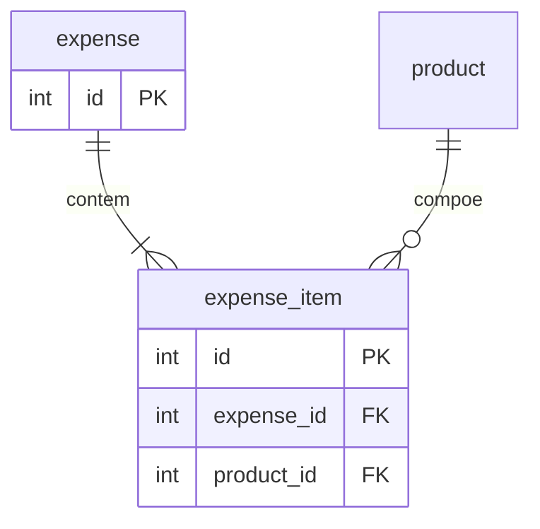

# Diagrama ER

Um diagrama por ilha. Tabela desenhada sem colunas pertence a outra ilha e aparece só para mostrar a ligação.

## <ilha>

```mermaid
erDiagram
    expense ||--|{ expense_item : contem
    product ||--o{ expense_item : compoe

    product

    expense {
        int id PK
    }
    expense_item {
        int id PK
        int expense_id FK
        int product_id FK
    }
```
