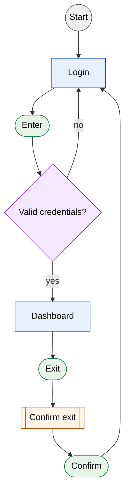

# Navigation

```mermaid
flowchart TD
  start(("Start")):::point --> login["Login"]:::screen
  login --> btn-enter(["Enter"]):::component
  btn-enter --> valid{"Valid credentials?"}:::decision
  valid -- yes --> dashboard["Dashboard"]:::screen
  valid -- no --> login
  dashboard --> btn-exit(["Exit"]):::component
  btn-exit --> modal-confirm-exit[["Confirm exit"]]:::subscreen
  modal-confirm-exit --> btn-confirm-exit(["Confirm"]):::component --> login

  click login "screens/login.md"
  click dashboard "screens/dashboard.md"
  click modal-confirm-exit "sub-screens/modal-confirm-exit.md"
  click btn-enter "components/btn-enter.md"
  click btn-exit "components/btn-exit.md"
  click btn-confirm-exit "components/btn-confirm-exit.md"

  classDef screen fill:#e8f0fe,stroke:#1a56db,color:#111
  classDef subscreen fill:#fff4e5,stroke:#b45309,color:#111
  classDef component fill:#e6f4ea,stroke:#15803d,color:#111
  classDef decision fill:#f3e8ff,stroke:#7e22ce,color:#111
  classDef point fill:#eee,stroke:#555,color:#111
```

## Entry points

- [login](screens/login.md): <how the user gets there>
